## Analyze the Application Data in Transformation Advisor
Start by launching the OpenShift Web Console from your Open Shift Clusters page in the IBM Cloud Dashboard.


In the console, select the project kabanero.
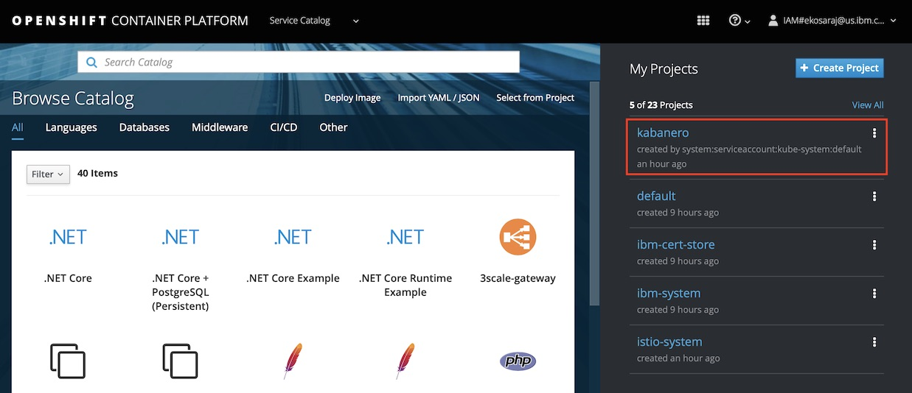

In the console, click the hamburger menu and select Cloud Pak for Applications.


This will take you to the **Cloud Pak for Applications** landing page.  Click on Instance and then the link next to Transformation Advisor.


This will launch the Transformation Advisor tool.
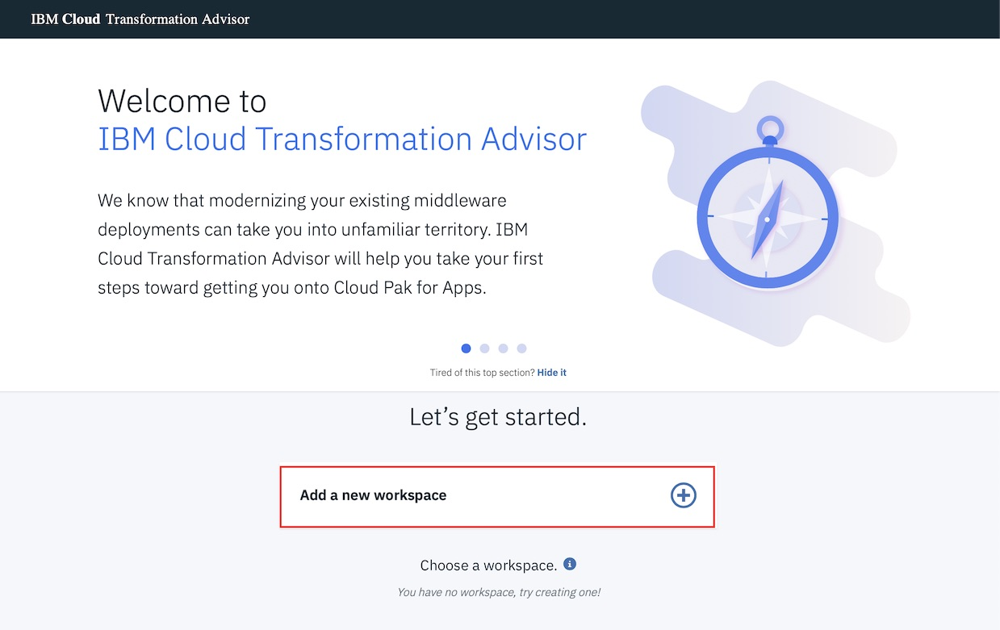

Create a new workspace by entering the workspace name as **Evaluation** and then
 clicking Next.
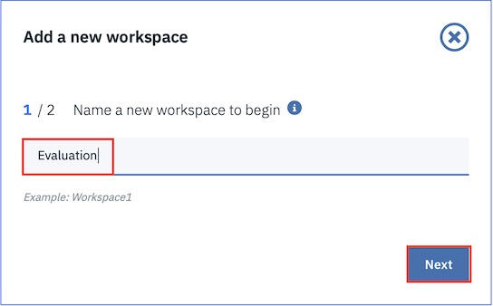

Note: A workspace is a designated area that will house the migration recommendations provided by Transformation Advisor against your application server environment. You can name and organize these however you want, whether it’s by business application, location or teams.

Enter the collection name as **ModResorts** and click **Let’s go**.

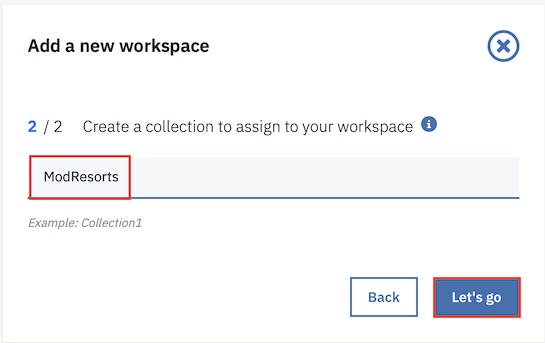

Note: Each workspace can be divided into collections for more focused assessment and planning. Like workspaces, collections can be named and organized in whatever way you want.

Once the Workspace and Collection are created, you will have options to either
download the Data Collector utility or upload existing data file. In this lab, we ae going to upload an existing data file that we got from running the Data Collector on the WebSphere instance.

Note: if you would like to go through the steps of running that data collector with WebSphere you will need to go through the full lab here:
*https://www.onlinedigitallearning.com/mod/page/view.php?id=74202*

### Upload and Analyze Data

When you run the data collector utility, the utility collects application data.  This process will take sometime to complete depending on how many applications deployed on the WAS server. When it is done, you will see a message “Thank you for uploading your data. You can proceed to the application UI for doing
further analysis.”  Your application data is collected, it is saved as a zip file. In this lab, you will download the zip files that have already been created by the data collector.

You have to download the collected data files from git hub. On your local workstation, run the command

```
git clone https://github.ibm.com/ProjectK8s/modernizeapplication-ta.git

cd modernizeapplication-ta
```
Now, from the console, select **Upload Data** to upload the zip file.


The next step provides the instructions on how to upload data. Select the **Drop or Add File** which will be show your workstation's filemanager. Navigate to the directory where you cloned the git. **ModResorts-AppSrv07.zip** is under data/modresorts directory.
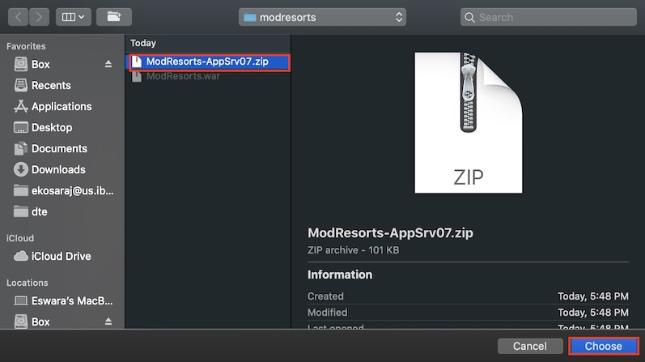

Select the file and select the **Upload** button. This takes few minutes to upload the data.


When the data upload is complete, the data analysis for ModResorts collection is loaded to the console.
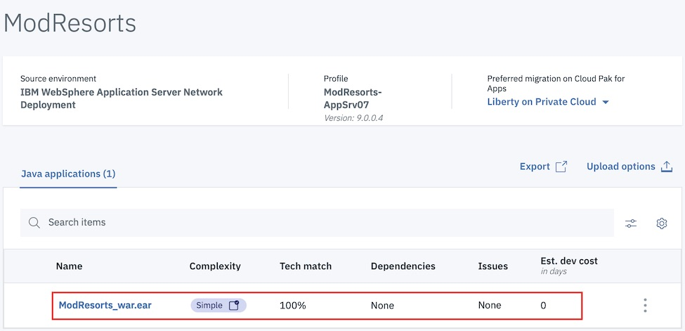

As, the ModResorts application is very simple, the detailed analysis is done on Day Trader application where some development cost is involved to clean some of the severr issues. Add a new collection, **DayTrader**  in the workspace **Evaluation**. This step is to upload a different collection to contrast the data analysis with a simple application of **Modresorts**. In navigation frame on left, select **+** in **Collection** section and name it as DayTrader.


Similar to above steps, choose the file **DayTrader-Dmgr01.zip** and upload. Once the upload is complete, this shows all the applications that were running on that particular WebSphere Application Server where the data collection is run.
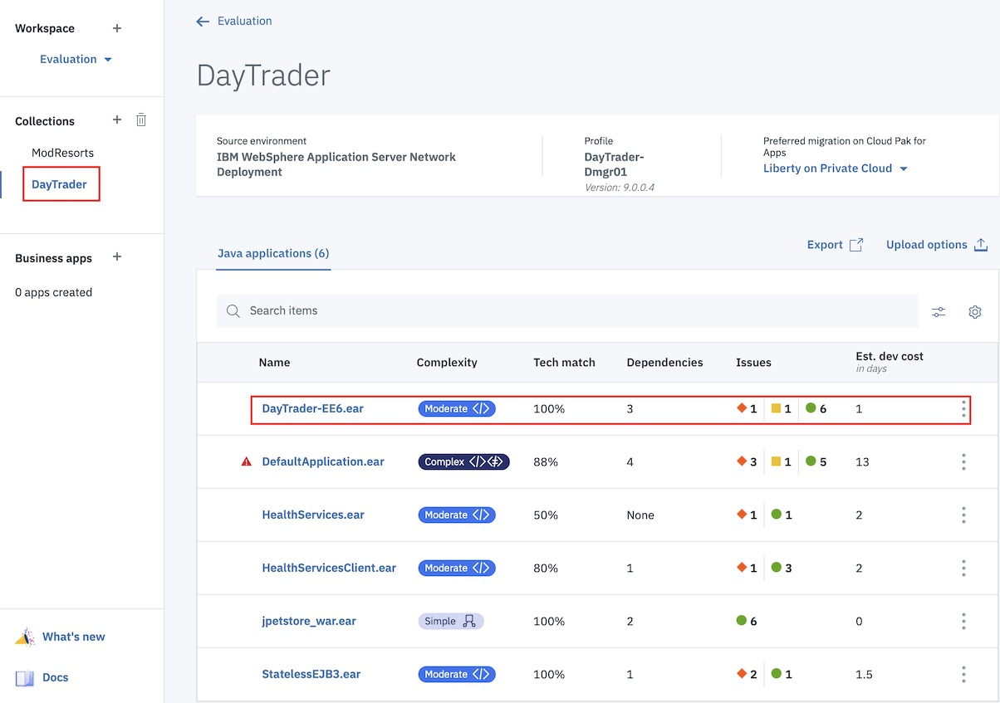

On the Recommendations page, the identified migration source environment is shown in the Profile section, and the target environment is shown in the Preferred migration section.

The data collector tool detects that the source environment is your WebSphere Application Server AppSrv01 profile. The target environment is Liberty on Private Cloud, which is the default target environment.

The Recommendations page also shows the summary analysis results for all the apps in the environment to be moved to a Liberty on Private Cloud environment.

For each app, you can see these results:

* Complexity level
* Technology match
* Dependencies
* Issues
* Estimated development cost in days

Select the highlighted application to analyze the reports that were produced. The first section in the detail analysis summary page is the Complexity. The overall complexity for  **DayTrader-EE6.ear** is moderate. This is based on the Stand Alone Application analysis rule.
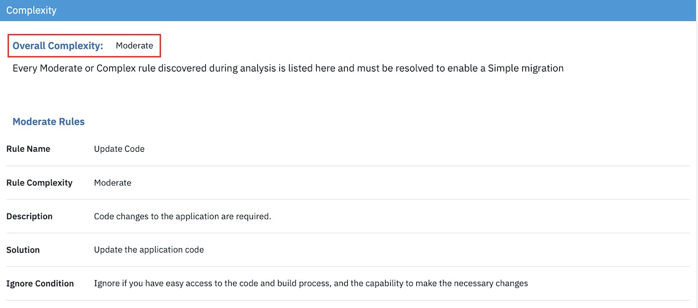

Scroll down to Application Details section. You can see although there is a code change required with some development cost and the estimated overall migration development cost is 5 days, including management, server configuration and testing. The estimate is based IBM migration engagements data.
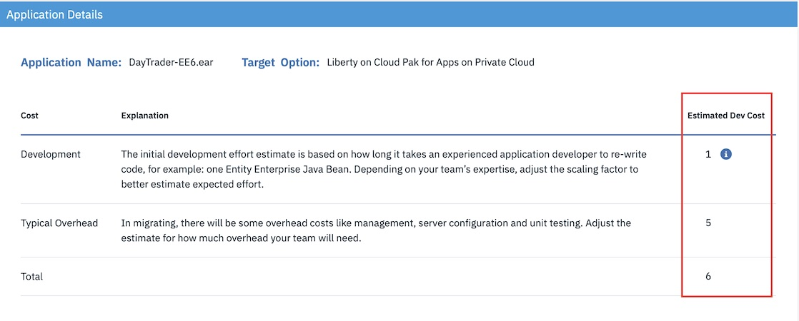

Next, going to Technology Issues section, you will find that some code changes were suggested. The External Dependency section shows that there no external dependencies to modernize the application.


At the bottom of the screen, you will find Additonal Information regarding the application and more detailed reports were provided.
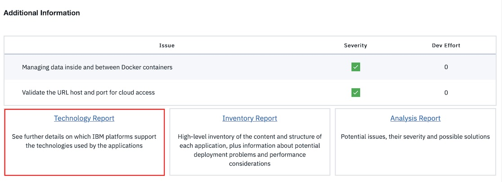

Now, select the **Technology Report** to get more details. This report lists all java technologies the application used and whether these technologies are supported by a specific WebSphere platform from Liberty for Java on IBM Cloud to WebSphere traditional for z/OS. It is used to determine whether a particular WebSphere platform is suitable for an application.


As we can see from the report, the DayTrader application is supported by all WebSphere platforms, based on the Java EE technologies used in the application.

Next, you select the Inventory Report, which helps you examine what is in your application, including the number of modules, their relationships and the technologies in those modules. It also gives you a view of all the utility JAR files in the application that tend to accumulate over time. Potential deployment problems and performance considerations are also included.


Scroll down to view this report, which serves as good decision-making to help you gain a better understanding of the application component relationships, and relative complexity of the application.


Scroll further down to view the inventory details and web service details by archive and potential deployment problems you may face during migration from WebSphere to Liberty.

Select the **Analysis Report** to view the potential issues, their severity with possible solutions. This is a deep-dive report showing all issue found at the code level.


Scroll down to Detailed Results by Rule section, you can see the java technology issues identified based different migration rules. Click the Show results link on the severe issue. You can see the detail analysis of the issue at code level in a specific class file and specific line. This will help pinpoint where the issue is located in the application.


Select the **Show rule help** link. The expanded Rule Help section provides recommended solutions on how to fix the issue.
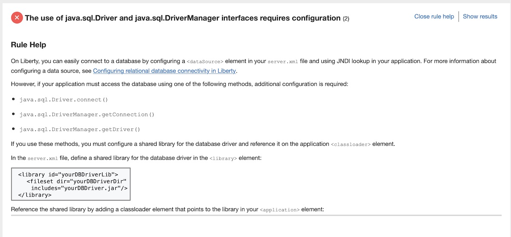

Check through other issues and you will find that for all the listed issue, a solution was provided which helps the developer. Next go back to **ModResorts** collection and view the reports. You will find that the application can be moved to a Liberty server.
