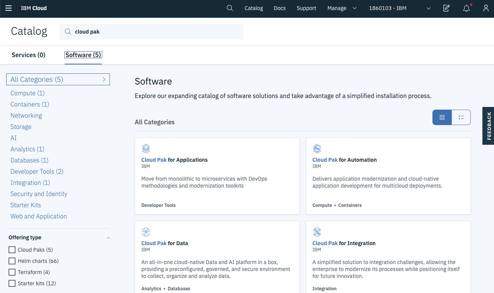
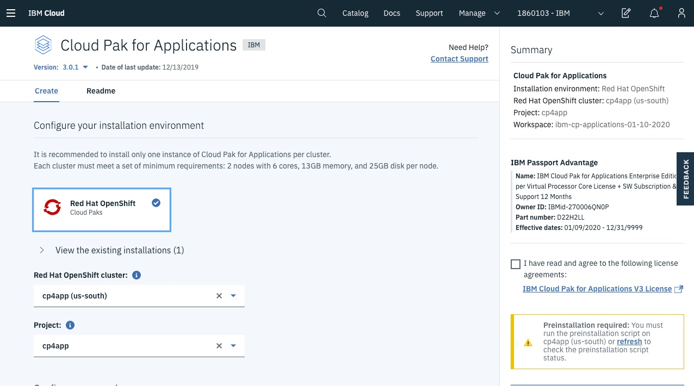
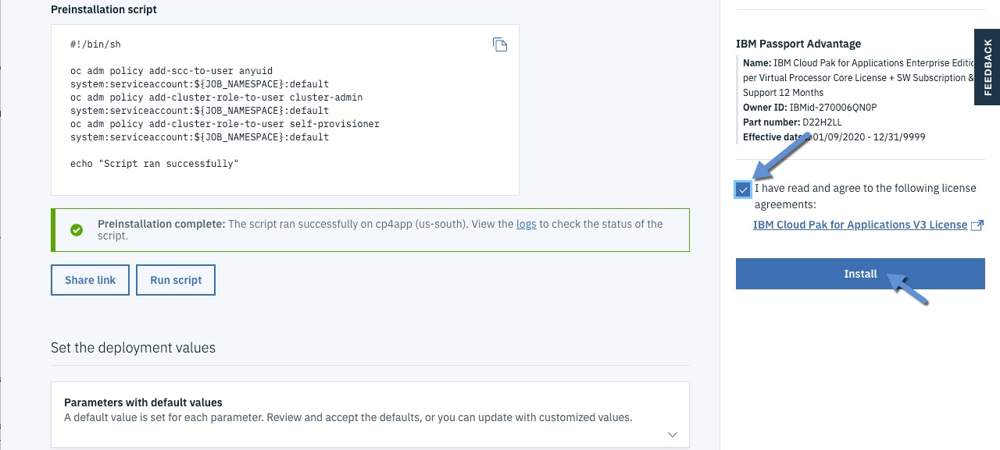

## Instructions for Installing Cloud Pak for Applications
Instructions are provided to install the Cloud Pak for Applications. This is a prerequisite for this lab and suggest every one to install on their IBM Cloud Managed OpenShift cluster before the lab. **This is not part of the lab and can be used for reference only**.

### Find Cloud Pak for Applications in the cloud catalog

* Log into the IBM Cloud Console.
* Click on Catalog
* Type Cloud Pak
* Go to the Software Tab
* Click on the Cloud Pak for Applications Tile

### Configure your installation environment

* select the cluster to install the cloud pak in.
* for the project, enter a project name such as cp4app

### Run the installation script

* keep the default values
* click Run script

The script takes a few minutes to run.

### Install the Cloud Pak

Once the preinstallation script completes:

* check the box after reading and agreeing to the licensing agreements
* click Install

The install will begin and take about 5 minutes to complete.
