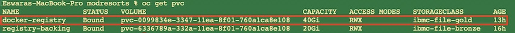

## Containerize the Liberty Application

In this task, you will create a Liberty image that has your migrated application installed and working, and then test the image to confirm that it is operating correctly.

Launch a terminal window and change the directory where you unzipped the migration bundle.
```
cd ~/Downloads
mkdir modresorts
cd modresorts
unzip -q ../modresortswar_migrationBundle.zip
```

Now, you OpenShift CLI **oc** to log in to your IBM Cloud Managed OpenShift Cluster. Go to your OpenShift console, select the **Avatar** and select **Copy Login Command** in the drop down. Paste the clipboard to your command window.
```
oc login https://c100-e.us-south.containers.cloud.ibm.com:xxxx --token=xxxxxxxxxx

oc project default

oc get routes
```

If you don't find any routes for the docker registry, you have to create one. This is required to push the docker image to the internal registry. Alternatively you can use **IBM Container Registry** also. To create the route, you need the domain name to use. To get the domain name, you can use the existing routes (registry-console).
```
oc get routes|grep registry-console|awk '{print $2}'|cut -f2- -d"."
eswaracluster-872b77d77f69503584da5a379a38af9c-0001.us-south.containers.appdomain.cloud

oc -n default create route --service=docker-registry --hostname=docker-registry.eswaracluster-872b77d77f69503584da5a379a38af9c-0001.us-south.containers.appdomain.cloud reencrypt
```
**Bonus Credit**: You can set a variable in your command window and use it rather typing the registry's long string. For example
```
export REGISTRY=docker-registry.eswaracluster-872b77d77f69503584da5a379a38af9c-0001.us-south.containers.appdomain.cloud

echo $REGISTRY
> Note: The registry route will be different in your environment
```

List the routes in default project (namespace) and you will find the route you just created.
```
oc get routes

use the route for docker registry

docker login -u $(oc whoami) -p $(oc whoami -t) docker-registry.eswaracluster-872b77d77f69503584da5a379a38af9c-0001.us-south.containers.appdomain.cloud

or

docker login -u $(oc whoami) -p $(oc whoami -t) $REGISTRY
```

By default, IBM Cloud Managed OpenShift uses ibm-file-bronze as default backend storage for the internal registry which is very slow. Encountered few issues while pushing docker images to it. So, as first step, you will change the IOPs of the persistent storage. You can follow the procedure as listed at *https://cloud.ibm.com/docs/openshift?topic=openshift-file_storage*. Alternatively, you can do the following. Open an editor like vi in the terminal, copy and paste the resource definition below and save it as *docker-registry.yaml*
```
apiVersion: v1
kind: PersistentVolumeClaim
metadata:
  annotations:
    volume.beta.kubernetes.io/storage-provisioner: ibm.io/ibmc-file
  finalizers:
  - kubernetes.io/pvc-protection
  name: docker-registry
  namespace: default
spec:
  accessModes:
  - ReadWriteMany
  resources:
    requests:
      storage: 40Gi
  storageClassName: ibmc-file-gold
status:
```
**Note**: You need have proper permissions to create a pvc. If not the pvc will be in a pending state.

Now create a new pvc, wait for the pvc to be created and then change the deployment of docker-registry to use this volume.
```
oc project default

oc create -f docker-registry.yaml

oc get pvc
```


```
oc set volume deployment/docker-registry --add --name=registry-storage -t pvc \
       --claim-name=docker-registry --overwrite

oc get pods
```

The above command will update the storage used docker-registry deployment to use the new pvc you just created. You will also find that the pods are being recreated and wait for the docker-registry pods to be in running state. For next steps, you will
* Run docker build from your workstation
* Test the application
* Push the container image to the OpenShift registry

```
docker build --no-cache -t docker-registry.eswaracluster-872b77d77f69503584da5a379a38af9c-0001.us-south.containers.appdomain.cloud/modresortswar/modresortswar:latest .

  > Note:
    • docker-registry.eswaracluster-872b77d77f69503584da5a379a38af9c-0001.us-south.containers.appdomain.cloud is your route of your docker registry
    • modresortwar is the namespace of the image
    • modresortswar is the container image name
    • latest is the tag for the container image

docker images | grep modresortswar ( shows the list of container images in your workstation )

```

To test the container image created, you will
```
docker run -p 9080:9080 docker-registry.eswaracluster-872b77d77f69503584da5a379a38af9c-0001.us-south.containers.appdomain.cloud/modresortswar/modresortswar:latest
```

Launch a browser on your workstation and type the url *http://localhost:9080/resorts*. Press **CTRL-C** after checking the webpage.
