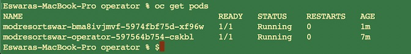

## Deploy Modernized Application to OpenShift Cluster

In this task you will deploy the docker image you have created to Red Hat OpenShift and create an instance of it. Before you begin, you will need push the docker image to the OpenShift image registry. From the same terminal window, assuming you have logged in to the OpenShift cluster
```
oc new-project modresortswar

docker login -u $(oc whoami) -p $(oc whoami -t) docker-registry.eswaracluster-872b77d77f69503584da5a379a38af9c-0001.us-south.containers.appdomain.cloud
```

Once the login succeeded, push the image to the registry

```
docker push docker-registry.eswaracluster-872b77d77f69503584da5a379a38af9c-0001.us-south.containers.appdomain.cloud/modresortswar/modresortswar:latest
```

Ensure the docker push completes. This may take few minutes to complete ( dependant on network bandwidth and latency). Check the images that were pushed.

```
oc get is --all-namespaces | grep modresorts

modresortswar   modresortswar    docker-registry.default.svc:5000/modresortswar/modresortswar   latest                         21 minutes ago

cd ~/Downloads/modresorts ( The directory where migration bundle you downloaded and unzipped)
cd operator

oc project modresortswar
oc apply -f application/application-crd.yaml
oc apply -f deploy/service_account.yaml
oc apply -f deploy/role.yaml
oc apply -f deploy/role_binding.yaml

oc apply -f deploy/operator.yaml
```

The last command creates an instance of Liberty Operator. Wait for the pod to be in running state.


Now deploy the Modresorts application using the custom resource artifact generated by TA.
```
oc apply -f application/application-cr.yaml
```

As next step, you will create a route to test the application.

```
oc get svc

This will show similar to
NAME                                      TYPE        CLUSTER-IP       EXTERNAL-IP   PORT(S)          AGE
modresortswar-bma8ivjmvf                  NodePort    172.21.13.15     <none>        9443:30770/TCP   7m
modresortswar-bma8ivjmvf-http-clusterip   ClusterIP   172.21.132.110   <none>        9080/TCP         7m

Create a route

oc create route edge modresorts --path /resorts --service=modresortswar-bma8ivjmvf-http-clusterip

> Note: In create route the service needs to match your environment

oc get routes

This will show

modresorts   modresorts-modresortswar.eswaracluster-872b77d77f69503584da5a379a38af9c-0001.us-south.containers.appdomain.cloud   /resorts   modresortswar-bma8ivjmvf-http-clusterip   http-service-liberty-clusterip   edge          None

> Note:  modresorts-modresortswar.eswaracluster-872b77d77f69503584da5a379a38af9c-0001.us-south.containers.appdomain.cloud is the route created.

```

Wait for the pods to be in running state.


Now, you can test the application using the URL https://modresorts-modresortswar.eswaracluster-872b77d77f69503584da5a379a38af9c-0001.us-south.containers.appdomain.cloud/resorts/

