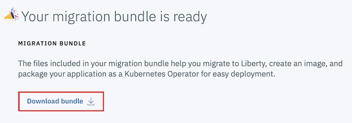

## Create Migration Bundle

Transformation Advisor has the ability to use the imported app analysis data to generate a migration bundle for the specified app and target environment to accelerate the migration of the application. We will use it to create our migration package for moving the **Modresorts** application to Liberty container on OpenShift cluster environment. In the navigation section, select **ModResorts** collection. Click the Action icon on ModResorts_war.ear application row and select the **View migration plan**.

Transformation Advisor is now starting to prepare the migration bundle package for the application. It will quickly prepare a migration bundle package with several required key files created from the application data collected from the WAS server, including server.xml, pom.xml, OpenShift Operator resource files and Dockerfile. However, the migration bundle needs a few more application specified dependencies like the application runtime binary file and other library files like database drivers required by the application.
For the **Modresorts** application, select the binary and add the binary file to the bundle.

Navigate to **{cloned directory path}/data/modresorts** directory and choose **ModResorts.war**.

For further steps, you can import this to a github project. The required detailed steps are provided. In this lab, you are not doing this task.

Detailed steps to migrate the application to container are provided. You can review those steps to deploy the application to **IBM Cloud Managed OpenShift Cluster**. As part of the lab, you are going to follow the instructions from **command line** as documented in later sections.

Go back to previous page on the browser to download the bundle by selecting the **Download bundle** button and save it to the **Downloads** directory on your workstation. This will be a zip file with name **modresortswar_migrationBundle.zip**. You can now unzip the bundle.

