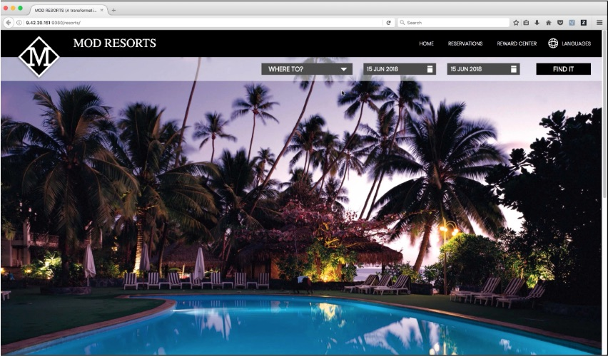

# Evaluate On-Premises JavaApplication with IBM Cloud Transformation Advisor on IBM Cloud Managed OpenShift and Cloud Pak for Applications

**Note: this lab is adopted from:
*https://www.onlinedigitallearning.com/mod/page/view.php?id=74202*
to work on IBM Cloud Managed Openshift**

<!-- TOC -->

- [Evaluate Java Application with IBM Cloud Transformation Advisor](#evaluate-on-premises-java-application-with-ibm-transformation-advisor)
- [Business Scenario](#business-sceario)
- [Objective](#objective)
- [Prerequisites](#prerequisites)
- [Cookbook](#cookbook)

<!-- TOC -->

# Evaluate On-Premises Java Applications with IBM Cloud Transformation Advisor

On the journey to cloud, enterprise customers are facing challenges moving their existing on-premises applications to the cloud quickly and cost-effectively.  The IBM Cloud Pak for Applications provides a complete and consistent experience and solution to modernize enterprise applications for cloud-native deployments. Customers can easily modernize their existing applications with IBM’s integrated tools and develop new cloud-native applications faster for deployment on any cloud.  One of the tools included in the Pak is the IBM Cloud Transformation Advisor (Transformation Advisor), a developer tool that is available at no charge to help you quickly evaluate on-premises Java EE applications for deployment to the cloud. The Transformation Advisor tool can

* Identify the Java EE programming models in the app.
* Determine the complexity of apps by listing a high-level inventory of the content and structure of each app.
* Highlight Java EE programming model and WebSphere API differences between the WebSphere profile types
* Learn any Java EE specification implementation differences that might affect the app

In addition, the tool provides a recommendation for the right-fit IBM WebSphere Application Server edition and offers advice, best practices and potential solutions to assess the ease of moving apps to Liberty or to newer versions of WebSphere traditional. It will accelerate application migrating to cloud process, minimize errors and risks and reduce time to market. This lab exercise will showthe value of using Transformation Advisorto evaluate on-premises WebSphere Application Server applications and identify a migration candidate for moving to cloud.  When you complete this lab, you will learn how to use this tool to quickly analyze on-premise Java applications without accessing their source codeand to estimate the move to cloud efforts.

# Business Scenario
As shown in the image below, your company has a web application called Mod Resorts, a WebSphere application showing the weather in various locations.

Your company wants to move the app to a lightweight WebSphere Liberty server on cloud, but you don't have the source code and are not sure how much effort the migration process might take. You decide to use the Transformation Advisor to quickly analyze this appand to identify if it is the right candidate application to move to cloud based on the analysis result.

# Objective
The objectives of this lab are to:

* Learn how to collect Java application and configuration data using the Transformation Advisor Data Collector tool.
* Learn how to use the Transformation Advisor to evaluate the move to cloud efforts and to identify the good candidate for migration.

# Prerequisites
The following prerequisites must be completed prior to beginning this lab:

* Familiarity with basic Linux commands.
* Have internet access.
* Have basic Java app development knowledge.
* Have an IBM Cloud Managed OpenShift Cluster deployed with the IBM Cloud Pak for Applications installed. To go through the process of installing IBM Cloud Pak for Applications, please follow:
 *https://cloud.ibm.com/docs/cloud-pak-applications?topic=cloud-pak-applications-getting-started#step-1-configure-your-installation-environment*
* Tools:
  * [oc](https://cloud.ibm.com/docs/openshift?topic=openshift-openshift-cli)
  * [git](https://git-scm.com/book/en/v2/Getting-Started-Installing-Git)
  * unzip - Windows you can use 7zip or winzip and Mac - built into the OS.
* Docker running on your workstation
  * [Install on Mac - Instructions](https://docs.docker.com/docker-for-mac/install/)
  * [Install on Windows 10 - Instructions](https://docs.docker.com/docker-for-windows/install/)

# Cookbook
1. [Install Cloud Pak for Applications](./CloudPak_Applications.md)
2. [Data Collection for Analysis & Modernization](./DataCollection.md)
3. [Analyze Application Data in TA - Tutorial for Fast Start 2020](./Analyze_TA.md)
4. [Create Migration Bundle - Optional](./MigrationBundle.md)
5. [Containerize the Application - Optional](./Containerize_Application.md)
6. [Deploy the Application - Optional](./Deploy_Application.md)

## Reference Materials

Additional Information:

* [Watch the video](https://www.youtube.com/watch?v=lzFI4e3Ed68)

* [Transformation Advisor introductory video](https://www.youtube.com/watch?v=yBZVb0KfPlc)

* [Deploying Transformation Advisor](https://developer.ibm.com/recipes/tutorials/deploying-transformation-advisor-into-ibm-cloud-private/)

* [Tutorial: Deploying apps into Kubernetes clusters](https://cloud.ibm.com/docs/containers/cs_tutorials_apps.html#cs_apps_tutorial)

* [Install Transformation Advisor locally](https://www.ibm.com/cloud/garage/tutorials/install-ibm-transformation-advisor-local)
