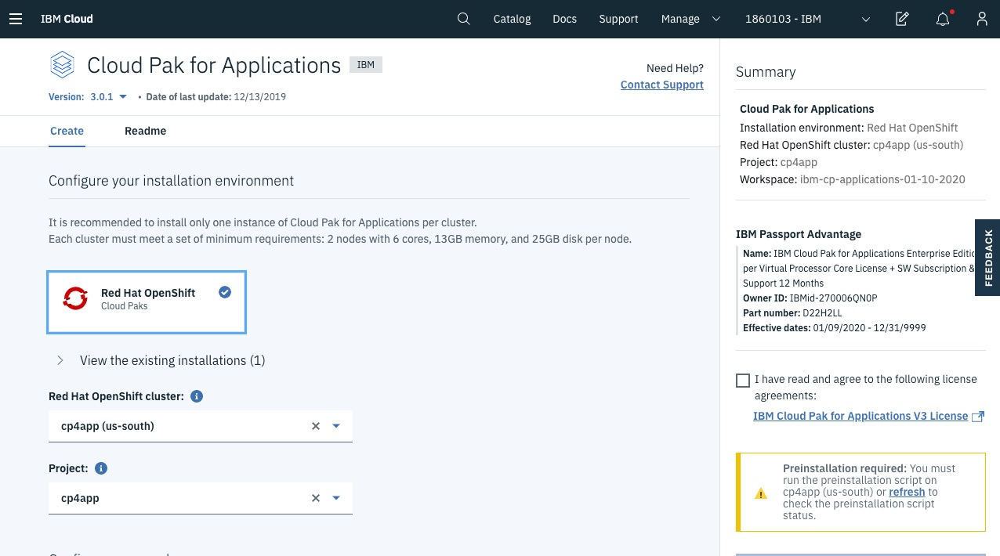
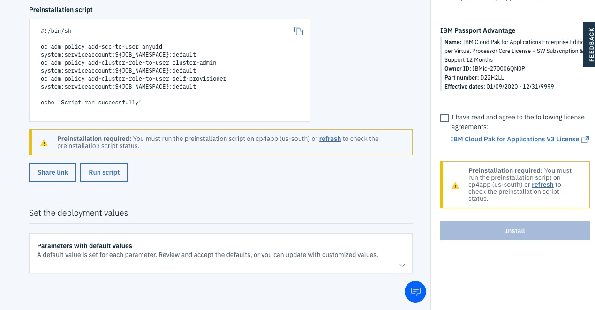
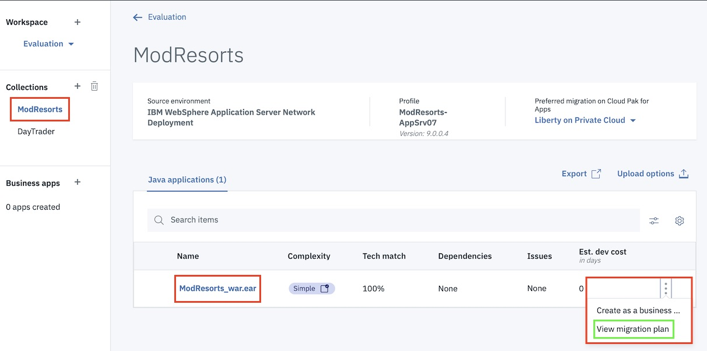
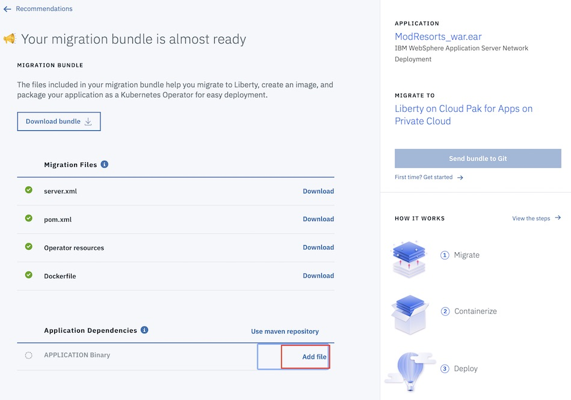
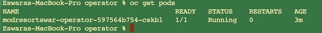

# Evaluate On-Premises JavaApplication with IBM Cloud Transformation Advisor on IBM Cloud Managed OpenrShift and Cloud Pak for Applications

**Note: this lab is adopted from:
*https://www.onlinedigitallearning.com/mod/page/view.php?id=74202*
to work on IBM Cloud Managed Openshift**

# Evaluate On-Premises Java Applications with IBM Cloud Transformation Advisor

On the journey to cloud, enterprise customers are facing challenges moving their existing on-premises applications to the cloud quickly and cost-effectively.  The IBM Cloud Pak for Applications provides a complete and consistent experience and solution to modernize enterprise applications for cloud-native deployments. Customers can easily modernize their existing applications with IBM’s integrated tools and develop new cloud-native applications faster for deployment on any cloud.  One of the tools included in the Pak is the IBM Cloud Transformation Advisor (Transformation Advisor), a developer tool that is available at no charge to help you quickly evaluate on-premises Java EE applications for deployment to the cloud. The Transformation Advisor tool can

* Identify the Java EE programming models in the app.
* Determine the complexity of apps by listing a high-level inventory of the content and structure of each app.
* Highlight Java EE programming model and WebSphere API differences between the WebSphere profile types
* Learn any Java EE specification implementation differences that might affect the app

In addition, the tool provides a recommendation for the right-fit IBM WebSphere Application Server edition and offers advice, best practices and potential solutions to assess the ease of moving apps to Liberty or to newer versions of WebSphere traditional. It will accelerate application migrating to cloud process, minimize errors and risks and reduce time to market. This lab exercise will showthe value of using Transformation Advisorto evaluate on-premises WebSphere Application Server applications and identify a migration candidate for moving to cloud.  When you complete this lab, you will learn how to use this tool to quickly analyze on-premise Java applications without accessing their source codeand to estimate the move to cloud efforts.

## Business Scenario
As shown in the image below, your company has a web application called Mod Resorts, a WebSphere application showing the weather in various locations.


Your company wants to move the app to a lightweight WebSphere Liberty server on cloud, but you don't have the source code and are not sure how much effort the migration process might take. You decide to use the Transformation Advisor to quickly analyze this appand to identify if it is the right candidate application to move to cloud based on the analysis result.

## Objective
The objectives of this lab are to:

* Learn how to collect Java application and configuration data using the Transformation Advisor Data Collector tool.
* Learn how to use the Transformation Advisor to evaluate the move to cloud efforts and to identify the good candidate for migration.

## Prerequisites
The following prerequisites must be completed prior to beginning this lab:

* Familiarity with basic Linux commands.
* Have internet access.
* Have basic Java app development knowledge.
* Have an IBM Cloud Managed OpenShift Cluster deployed with the IBM Cloud Pak for Applications installed. To go through the process of installing IBM Cloud Pak for Applications, please follow:
 *https://cloud.ibm.com/docs/cloud-pak-applications?topic=cloud-pak-applications-getting-started#step-1-configure-your-installation-environment*
* Tools: 
  * [oc](https://cloud.ibm.com/docs/openshift?topic=openshift-openshift-cli)
  * [git](https://git-scm.com/book/en/v2/Getting-Started-Installing-Git)
  * unzip - Windows you can use 7zip or winzip and Mac - built into the OS.
* Docker running on your workstation
  * [Install on Mac - Instructions](https://docs.docker.com/docker-for-mac/install/)
  * [Install on Windows 10 - Instructions](https://docs.docker.com/docker-for-windows/install/)


## Instructions for Installing Cloud Pak for Applications
Instructions are provided to install the Cloud Pak for Applications. This is a prerequisite for this lab and suggest every one to install on their IBM Cloud Managed OpenShift cluster before the lab. **This is not part of the lab and can be used for reference only**.

### Find Cloud Pak for Applications in the cloud catalog


* Log into the IBM Cloud Console.
* Click on Catalog
* Type Cloud Pak
* Go to the Software Tab
* Click on the Cloud Pak for Applications Tile

### Configure your installation environment


* select the cluster to install the cloud pak in.
* for the project, enter a project name such as cp4app

### Run the installation script


* keep the default values
* click Run script

The script takes a few minutes to run.

### Install the Cloud Pak


Once the preinstallation script completes:

* check the box after reading and agreeing to the licensing agreements
* click Install

The install will begin and take about 5 minutes to complete.

## DataCollection for the Analysis and Modernization Task
In this lab, you access WebSphere Application Server to review the deployment of the Mod Resorts application. To identify which Java EE programming models are on the server, you could run the Transformation Advisor Data Collector tool against the server. The Transformation Advisor creates an inventory of the content and structure of each app and learn about problems that might occur if you move the app to cloud. Finally, you review the analysis reports to determine the complexity of the move-to-cloud efforts and select the migration candidate app.

Here are the activities involved in this process:

The following two tasks are optional and require a demo account to access the Websphere Application.  To go through these tasks, please follow 6.1 and 6.2 in the full lab:
*https://www.onlinedigitallearning.com/mod/page/view.php?id=74202*
* Log in to WebSphere Application Server to review the deployed apps
* Start and run the Mod Resorts application in web browser
* Run the Transformation Advisor Data Collector tool against the WebSphere Application Server to get application data

Note: this lab will start by importing the data previously gathered about the WebSphere Application.
* Import the data collection tool output.
* Review the analysis reports that Transformation Advisor generates to identify if the application is a right candidate for rapid and cost-effective migration to cloud.

## Analyze the Application Data in Transformation Advisor
Start by launching the OpenShift Web Console from your Open Shift Clusters page in the IBM Cloud Dashboard.


In the console, select the project kabanero.


In the console, click the hamburger menu and select Cloud Pak for Applications.


This will take you to the **Cloud Pak for Applications** landing page.  Click on Instance and then the link next to Transformation Advisor.


This will launch the Transformation Advisor tool.


Create a new workspace by entering the workspace name as **Evaluation** and then
 clicking Next.


Note: A workspace is a designated area that will house the migration recommendations provided by Transformation Advisor against your application server environment. You can name and organize these however you want, whether it’s by business application, location or teams.

Enter the collection name as **ModResorts** and click **Let’s go**.


Note: Each workspace can be divided into collections for more focused assessment and planning. Like workspaces, collections can be named and organized in whatever way you want.

Once the Workspace and Collection are created, you will have options to either
download the Data Collector utility or upload existing data file. In this lab, we ae going to upload an existing data file that we got from running the Data Collector on the WebSphere instance.

Note: if you would like to go through the steps of running that data collector with WebSphere you will need to go through the full lab here:
*https://www.onlinedigitallearning.com/mod/page/view.php?id=74202*

### Upload and Analyze Data

When you run the data collector utility, the utility collects application data.  This process will take sometime to complete depending on how many applications deployed on the WAS server. When it is done, you will see a message “Thank you for uploading your data. You can proceed to the application UI for doing
further analysis.”  Your application data is collected, it is saved as a zip file. In this lab, you will download the zip files that have already been created by the data collector.

You have to download the collected data files from git hub. On your local workstation, run the command

```
git clone https://github.ibm.com/ProjectK8s/modernizeapplication-ta.git

cd modernizeapplication-ta
```
Now, from the console, select **Upload Data** to upload the zip file.


The next step provides the instructions on how to upload data. Select the **Drop or Add File** which will be show your workstation's filemanager. Navigate to the directory where you cloned the git. **ModResorts-AppSrv07.zip** is under data/modresorts directory.


Select the file and select the **Upload** button. This takes few minutes to upload the data.


When the data upload is complete, the data analysis for ModResorts collection is loaded to the console.


As, the ModResorts application is very simple, the detailed analysis is done on Day Trader application where some development cost is involved to clean some of the severr issues. Add a new collection, **DayTrader**  in the workspace **Evaluation**. This step is to upload a different collection to contrast the data analysis with a simple application of **Modresorts**. In navigation frame on left, select **+** in **Collection** section and name it as DayTrader.


Similar to above steps, choose the file **DayTrader-Dmgr01.zip** and upload. Once the upload is complete, this shows all the applications that were running on that particular WebSphere Application Server where the data collection is run.


On the Recommendations page, the identified migration source environment is shown in the Profile section, and the target environment is shown in the Preferred migration section.

The data collector tool detects that the source environment is your WebSphere Application Server AppSrv01 profile. The target environment is Liberty on Private Cloud, which is the default target environment.

The Recommendations page also shows the summary analysis results for all the apps in the environment to be moved to a Liberty on Private Cloud environment.

For each app, you can see these results:

* Complexity level
* Technology match
* Dependencies
* Issues
* Estimated development cost in days

Select the highlighted application to analyze the reports that were produced. The first section in the detail analysis summary page is the Complexity. The overall complexity for  **DayTrader-EE6.ear** is moderate. This is based on the Stand Alone Application analysis rule.


Scroll down to Application Details section. You can see although there is a code change required with some development cost and the estimated overall migration development cost is 5 days, including management, server configuration and testing. The estimate is based IBM migration engagements data.


Next, going to Technology Issues section, you will find that some code changes were suggested. The External Dependency section shows that there no external dependencies to modernize the application.


At the bottom of the screen, you will find Additonal Information regarding the application and more detailed reports were provided.


Now, select the **Technology Report** to get more details. This report lists all java technologies the application used and whether these technologies are supported by a specific WebSphere platform from Liberty for Java on IBM Cloud to WebSphere traditional for z/OS. It is used to determine whether a particular WebSphere platform is suitable for an application.


As we can see from the report, the DayTrader application is supported by all WebSphere platforms, based on the Java EE technologies used in the application.

Next, you select the Inventory Report, which helps you examine what is in your application, including the number of modules, their relationships and the technologies in those modules. It also gives you a view of all the utility JAR files in the application that tend to accumulate over time. Potential deployment problems and performance considerations are also included.


Scroll down to view this report, which serves as good decision-making to help you gain a better understanding of the application component relationships, and relative complexity of the application.


Scroll further down to view the inventory details and web service details by archive and potential deployment problems you may face during migration from WebSphere to Liberty.

Select the **Analysis Report** to view the potential issues, their severity with possible solutions. This is a deep-dive report showing all issue found at the code level.


Scroll down to Detailed Results by Rule section, you can see the java technology issues identified based different migration rules. Click the Show results link on the severe issue. You can see the detail analysis of the issue at code level in a specific class file and specific line. This will help pinpoint where the issue is located in the application.


Select the **Show rule help** link. The expanded Rule Help section provides recommended solutions on how to fix the issue.


Check through other issues and you will find that for all the listed issue, a solution was provided which helps the developer. Next go back to **ModResorts** collection and view the reports. You will find that the application can be moved to a Liberty server.

## Create Migration Bundle

Transformation Advisor has the ability to use the imported app analysis data to generate a migration bundle for the specified app and target environment to accelerate the migration of the application. We will use it to create our migration package for moving the **Modresorts** application to Liberty container on OpenShift cluster environment. In the navigation section, select **ModResorts** collection. Click the Action icon on ModResorts_war.ear application row and select the **View migration plan**.


Transformation Advisor is now starting to prepare the migration bundle package for the application. It will quickly prepare a migration bundle package with several required key files created from the application data collected from the WAS server, including server.xml, pom.xml, OpenShift Operator resource files and Dockerfile. However, the migration bundle needs a few more application specified dependencies like the application runtime binary file and other library files like database drivers required by the application.
For the **Modresorts** application, select the binary and add the binary file to the bundle.


Navigate to **{cloned directory path}/data/modresorts** directory and choose **ModResorts.war**.


For further steps, you can import this to a github project. The required detailed steps are provided. In this lab, you are not doing this task.


Detailed steps to migrate the application to container are provided. You can review those steps to deploy the application to **IBM Cloud Managed OpenShift Cluster**. As part of the lab, you are going to follow the instructions from **command line** as documented in later sections.


Go back to previous page on the browser to download the bundle by selecting the **Download bundle** button and save it to the **Downloads** directory on your workstation. This will be a zip file with name **modresortswar_migrationBundle.zip**. You can now unzip the bundle.


## Containerize the Liberty Application

In this task, you will create a Liberty image that has your migrated application installed and working, and then test the image to confirm that it is operating correctly.

Launch a terminal window and change the directory where you unzipped the migration bundle.
```
cd ~/Downloads
mkdir modresorts
cd modresorts
unzip -q ../modresortswar_migrationBundle.zip
```

Now, you OpenShift CLI **oc** to log in to your IBM Cloud Managed OpenShift Cluster. Go to your OpenShift console, select the **Avatar** and select **Copy Login Command** in the drop down. Paste the clipboard to your command window.
```
oc login https://c100-e.us-south.containers.cloud.ibm.com:xxxx --token=xxxxxxxxxx

oc project default

oc get routes
```

If you don't find any routes for the docker registry, you have to create one. This is required to push the docker image to the internal registry. Alternatively you can use **IBM Container Registry** also. To create the route, you need the domain name to use. To get the domain name, you can use the existing routes (registry-console).
```
oc get routes|grep registry-console|awk '{print $2}'|cut -f2- -d"."
eswaracluster-872b77d77f69503584da5a379a38af9c-0001.us-south.containers.appdomain.cloud

oc -n default create route --service=docker-registry --hostname=docker-registry.eswaracluster-872b77d77f69503584da5a379a38af9c-0001.us-south.containers.appdomain.cloud reencrypt
```
**Bonus Credit**: You can set a variable in your command window and use it rather typing the registry's long string. For example
```
export REGISTRY=docker-registry.eswaracluster-872b77d77f69503584da5a379a38af9c-0001.us-south.containers.appdomain.cloud

echo $REGISTRY
> Note: The registry route will be different in your environment
```

List the routes in default project (namespace) and you will find the route you just created.
```
oc get routes

use the route for docker registry

docker login -u $(oc whoami) -p $(oc whoami -t) docker-registry.eswaracluster-872b77d77f69503584da5a379a38af9c-0001.us-south.containers.appdomain.cloud

or

docker login -u $(oc whoami) -p $(oc whoami -t) $REGISTRY
```

By default, IBM Cloud Managed OpenShift uses ibm-file-bronze as default backend storage for the internal registry which is very slow. Encountered few issues while pushing docker images to it. So, as first step, you will change the IOPs of the persistent storage. You can follow the procedure as listed at *https://cloud.ibm.com/docs/openshift?topic=openshift-file_storage*. Alternatively, you can do the following. Open an editor like vi in the terminal, copy and paste the resource definition below and save it as *docker-registry.yaml*
```
apiVersion: v1
kind: PersistentVolumeClaim
metadata:
  annotations:
    volume.beta.kubernetes.io/storage-provisioner: ibm.io/ibmc-file
  finalizers:
  - kubernetes.io/pvc-protection
  name: docker-registry
  namespace: default
spec:
  accessModes:
  - ReadWriteMany
  resources:
    requests:
      storage: 40Gi
  storageClassName: ibmc-file-gold
status:
```
**Note**: You need have proper permissions to create a pvc. If not the pvc will be in a pending state.

Now create a new pvc, wait for the pvc to be created and then change the deployment of docker-registry to use this volume.
```
oc project default

oc create -f docker-registry.yaml

oc get pvc
```


```
oc set volume deployment/docker-registry --add --name=registry-storage -t pvc \
       --claim-name=docker-registry --overwrite

oc get pods
```

The above command will update the storage used docker-registry deployment to use the new pvc you just created. You will also find that the pods are being recreated and wait for the docker-registry pods to be in running state. For next steps, you will
* Run docker build from your workstation
* Test the application
* Push the container image to the OpenShift registry

```
docker build --no-cache -t docker-registry.eswaracluster-872b77d77f69503584da5a379a38af9c-0001.us-south.containers.appdomain.cloud/modresortswar/modresortswar:latest .

  > Note:
    • docker-registry.eswaracluster-872b77d77f69503584da5a379a38af9c-0001.us-south.containers.appdomain.cloud is your route of your docker registry
    • modresortwar is the namespace of the image
    • modresortswar is the container image name
    • latest is the tag for the container image

docker images | grep modresortswar ( shows the list of container images in your workstation )

```

To test the container image created, you will
```
docker run -p 9080:9080 docker-registry.eswaracluster-872b77d77f69503584da5a379a38af9c-0001.us-south.containers.appdomain.cloud/modresortswar/modresortswar:latest
```

Launch a browser on your workstation and type the url *http://localhost:9080/resorts*. Press **CTRL-C** after checking the webpage.

## Deploy Modernized Application to OpenShift Cluster

In this task you will deploy the docker image you have created to Red Hat OpenShift and create an instance of it. Before you begin, you will need push the docker image to the OpenShift image registry. From the same terminal window, assuming you have logged in to the OpenShift cluster
```
oc new-project modresortswar

docker login -u $(oc whoami) -p $(oc whoami -t) docker-registry.eswaracluster-872b77d77f69503584da5a379a38af9c-0001.us-south.containers.appdomain.cloud
```

Once the login succeeded, push the image to the registry

```
docker push docker-registry.eswaracluster-872b77d77f69503584da5a379a38af9c-0001.us-south.containers.appdomain.cloud/modresortswar/modresortswar:latest
```

Ensure the docker push completes. This may take few minutes to complete ( dependant on network bandwidth and latency). Check the images that were pushed.

```
oc get is --all-namespaces | grep modresorts

modresortswar   modresortswar    docker-registry.default.svc:5000/modresortswar/modresortswar   latest                         21 minutes ago

cd ~/Downloads/modresorts ( The directory where migration bundle you downloaded and unzipped)
cd operator

oc project modresortswar
oc apply -f application/application-crd.yaml
oc apply -f deploy/service_account.yaml
oc apply -f deploy/role.yaml
oc apply -f deploy/role_binding.yaml

oc apply -f deploy/operator.yaml
```

The last command creates an instance of Liberty Operator. Wait for the pod to be in running state.


Now deploy the Modresorts application using the custom resource artifact generated by TA.
```
oc apply -f application/application-cr.yaml
```

As next step, you will create a route to test the application.

```
oc get svc

This will show similar to
NAME                                      TYPE        CLUSTER-IP       EXTERNAL-IP   PORT(S)          AGE
modresortswar-bma8ivjmvf                  NodePort    172.21.13.15     <none>        9443:30770/TCP   7m
modresortswar-bma8ivjmvf-http-clusterip   ClusterIP   172.21.132.110   <none>        9080/TCP         7m

Create a route

oc create route edge modresorts --path /resorts --service=modresortswar-bma8ivjmvf-http-clusterip

> Note: In create route the service needs to match your environment

oc get routes

This will show

modresorts   modresorts-modresortswar.eswaracluster-872b77d77f69503584da5a379a38af9c-0001.us-south.containers.appdomain.cloud   /resorts   modresortswar-bma8ivjmvf-http-clusterip   http-service-liberty-clusterip   edge          None

> Note:  modresorts-modresortswar.eswaracluster-872b77d77f69503584da5a379a38af9c-0001.us-south.containers.appdomain.cloud is the route created.

```

Wait for the pods to be in running state.


Now, you can test the application using the URL https://modresorts-modresortswar.eswaracluster-872b77d77f69503584da5a379a38af9c-0001.us-south.containers.appdomain.cloud/resorts/


## Links

Additional Information:

* [Watch the video](https://www.youtube.com/watch?v=lzFI4e3Ed68)
* [Transformation Advisor introductory video](https://www.youtube.com/watch?v=yBZVb0KfPlc)
* [Deploying Transformation Advisor](https://developer.ibm.com/recipes/tutorials/deploying-transformation-advisor-into-ibm-cloud-private/)
* [Tutorial: Deploying apps into Kubernetes clusters](https://cloud.ibm.com/docs/containers/cs_tutorials_apps.html#cs_apps_tutorial)
* [Install Transformation Advisor locally](https://www.ibm.com/cloud/garage/tutorials/install-ibm-transformation-advisor-local)
